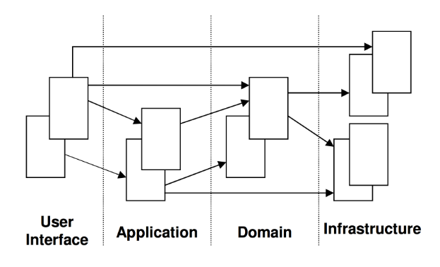

# 领域驱动设计（DDD）

----
## 统一建模语言（UML）
[点击进入详情](uml.md)  
  * 可用于描述领域模型。

## 什么是领域驱动设计
在开发前，需进行大量的业务知识梳理，然后到达软件设计层面，最后进行开发。  
而在业务知识梳理过程中，必回形成某个领域知识，而**根据领域知识来驱动软件（程序）设计**，就是**领域驱动设计**。  

### 领域驱动设计的阶段
主要分为两个阶段：  
  * 以一种领域专家、设计人员、开发人员都能理解的通用语言作为相互交流的工具，在交流的过程中发现领域概念，然后将这些概念设计成一个领域模型；
  * 由领域模型驱动软件设计，用代码来实现该领域模型。
故，领域驱动设计的核心是建立正确的领域模型。

### 领域模型的特点
  * 领域模型是对具有某个边界的领域的一个抽象，反映了领域内用户业务需求的本质；领域模型是有边界的，只反应了我们在领域内所关注的部分；
  * 领域模型只反映业务，和任何技术实现无关；领域模型不仅能反映领域中的一些实体概念，如货物，书本，应聘记录，地址，等；还能反映领域中的一些过程概念，如资金转账，等；
  * 领域模型确保了我们的软件的业务逻辑都在一个模型中，都在一个地方；这样对提高软件的可维护性，业务可理解性以及可重用性方面都有很好的帮助；
  * 领域模型能够帮助开发人员相对平滑地将领域知识转化为软件构造；
  * 领域模型贯穿软件分析、设计，以及开发的整个过程；领域专家、设计人员、开发人员通过领域模型进行交流，彼此共享知识与信息；因为大家面向的都是同一个模型，所以可以防止需求走样，可以让软件设计开发人员做出来的软件真正满足需求；
  * 要建立正确的领域模型并不简单，需要领域专家、设计、开发人员积极沟通共同努力，然后才能使大家对领域的认识不断深入，从而不断细化和完善领域模型；
  * 为了让领域模型看的见，我们需要用一些方法来表示它；图是表达领域模型最常用的方式，但不是唯一的表达方式，代码或文字描述也能表达领域模型；
  * 领域模型是整个软件的核心，是软件中最有价值和最具竞争力的部分；设计足够精良且符合业务需求的领域模型能够更快速的响应需求变化。

### 领域建模的思考角度
  * 不以用户为绝对中心，而应从一个客观的角度，根据用户需求挖掘出领域内的相关事物，思考这些事物的本质关联及其变化规律作为出发点去思考问题。
  * 领域建模是建立虚拟模型让我们现实的人使用，而不是建立虚拟空间，去模仿现实。

### DDD的层架构（Layered Architecture）
  

#### User Interface【用户界面/展现层】
负责向用户展现信息，并且会解析用户行为。即：
  * 请求应用层以获取用户所需要展现的数据；
  * 发送命令给应用层要求其执行某个用户命令。

#### Application Layer【应用层】
无任何的业务逻辑代码，定义软件要完成的所有任务。对外为展现层提供各种应用功能（包括查询或命令），对内调用领域层（领域对象或领域服务）完成各种业务逻辑，应用层不包含业务逻辑。

#### Domain Layer【领域层】
包含有关领域的信息，是业务的核心，领域模型的状态都直接或间接（持久化至数据库）存储在这一层。

#### Infrastructure Layer【基础设施层】
本层为其他层提供通用的技术能力；提供了层间的通信；为领域层实现持久化机制；总之，基础设施层可以通过架构和框架来支持其他层的技术需求。

#### 扩展
MVC模式就是一种分层架构，我们尽可能去设计每一层，使其保持高度内聚性，让它们只对下层进行依赖，体现了高内聚低耦合的思想。  
用户界面层我们可以理解成web层的Controller，应用层和业务无关，它负责协调领域层进行工作，领域层是DDD的业务核心，包含领域模型和领域服务，领域层的重点放在如何表达领域模型上，无需考虑显示和存储问题，基础实施层是最底层，提供基础的接口和实现，领域层和应用服务层通过基础实施层提供的接口实现类如持久化、发送消息等功能。  

##### 改进DDD分层架构和DIP依赖倒置原则
**DIP依赖倒置原则**：高层模块不应该依赖于低层模块，两者都应该依赖于抽象，抽象不应该依赖于细节，细节应该依赖于抽象。  
  
由上图可知，基础实施层位于其他所有层的上方，接口定义在其它层，基础实施实现这些接口。  
依赖原则的定义在DDD设计中可以改述为：领域层等其他层不应该依赖于基础实施层，两者都应该依赖于抽象，具体落地的时候，这些抽象的接口定义放在了领域层等下方层中。  
这也就是意味着一个重要的落地指导原则： 所有依赖基础实施实现的抽象接口，都应该定义在领域层或应用层中。  
这种分层结构更加地高内聚低耦合。每一层只依赖于抽象，因为具体的实现在基础实施层，无需关心。只要抽象不变，就无需改动那一层，实现如果需要改变，只需要修改基础实施层就可以了。  

### DDD的模型关系图（Model-Driven Design）
  
**对象的关联的设计可以遵循如下的一些原则**：  
  * 关联尽量少，对象之间的复杂的关联容易形成对象的关系网，这样对于我们理解和维护单个对象很不利，同时也很难划分对象与对象之间的边界；另外，同时减少关联有助于简化对象之间的遍历；
  * 对多的关联也许在业务上是很自然的，通常我们会用一个集合来表示1对多的关系。但我们往往也需要考虑到性能问题，尤其是当集合内元素非常多的时候，此时往往需要通过单独查询来获取关联的集合信息；
  * 关联尽量保持单向的关联；
  * 在建立关联时，我们需要深入去挖掘是否存在关联的限制条件，如果存在，那么最好把这个限制条件加到这个关联上；往往这样的限制条件能将关联化繁为简，即可以将多对多简化为1对多，或将1对多简化为1对1。