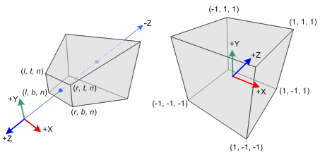

# 观察空间到裁剪空间的投影矩阵推导

## 关于观察空间和裁剪空间
### 观察空间（view space）
  * 观察空间也被称为**摄像机空间（camera space）**，是**模型空间（model space，随着模型移动而移动的空间）**的一个特例。
  * 观察空间是一个三维空间，而屏幕空间是一个二维空间。从观察空间到屏幕空间的转换需要经过一个操作，那就是**投影（projection）**。

### 裁剪空间（clip space）
  * 裁剪空间也被称为**齐次裁剪空间**。
  * 裁剪空间的目标是能够方便地对渲染图元进行裁剪；完全位于这块空间内部的图元将会被保留，完全位于这块空间外部的图元将会被剔除，而与这块空间边界相交的图元则会被裁剪。

## 关于透视投影和正交投影
裁剪空间由**视锥体（view frustum）**决定，而视锥体由六个**裁剪平面（clip planes）**包围而成。  
在视锥体的裁剪平面中，由2块裁剪平面比较特殊，其分别被称为**近裁剪平面（neer clip plane）**和**远裁剪平面（far clip plane）**。它们决定了摄像机可以看到的深度范围。  
视锥体有两种类型，一种是**透视投影（perspective projection）**，另一种是**正交投影（orthographic projection）**。

### 透视投影
  * 在透视投影中，地板上的平行线并不会保持平行，离摄像机越近网格越大，离摄像机越远网格越小。
  * 此投影方式模拟了人眼看世界的方式。
  * 此投影一般应用于追求正式工的3D游戏中。

### 正交投影
  * 在正交投影中，所有的网格大小都一样，而且平行线会一直保持平行。
  * 此投影完全保留了物体的距离和角度。
  * 此投影一般应用于2D游戏或渲染小地图等其他HUD（Head Up Display，平视显示器））元素。

## 关于投影矩阵
**投影矩阵（projection matrx）**又称为**裁剪矩阵（clip matrix）**。  
该矩阵的作用是，将顶点从观察空间转换到裁剪空间。

### 投影矩阵的目的
  * 首先为投影做准备。虽然投影矩阵的名称包含了投影二字，但是它并没有进行真正的投影工作，而是在为投影做准备。真正的投影发生在**齐次除法（homogeneous division）**过程中。而经过投影矩阵的变换后，顶点的w分量将会具有特殊的意义。
  * 其次是对x、y、z分量进行缩放。经过投影矩阵的缩放后，可以直接使用w分量作为一个范围值，如果x、y、z分量都位于这个范围内，就说明该顶点位于裁剪空间内。

## 透视投影矩阵推导
### 变量及符号定义

### 透视投影视锥体

### 观察空间中的点(xe,ye,ze)投影至近平面上的点(xp,yp,zp)

### 观察坐标、裁剪坐标、归一化坐标（NDC）
#### 裁减坐标的w分量（推导投影矩阵的第4行）

### 线性关系映射xp与yp到NDC的xn与yn
#### 推导裁剪坐标的xc与yc（推导投影矩阵的第1、2行）

### 逆投影（逆变换）操作找寻zn与ze之间的关系
### 推导投影矩阵的第3行

## 正交投影矩阵推导
### 观察空间的xe、ye与ze分量线性映射到NDC

### 正交投影并不需要w分量